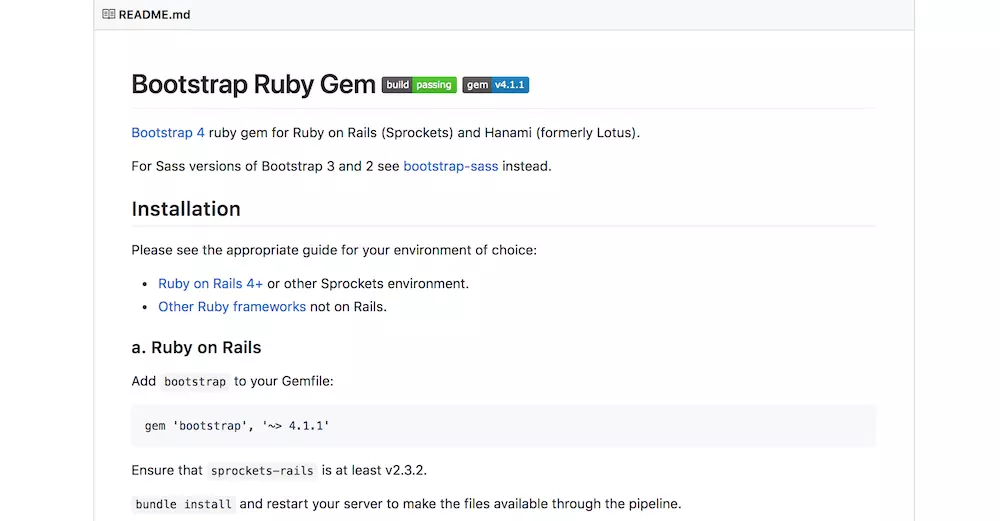
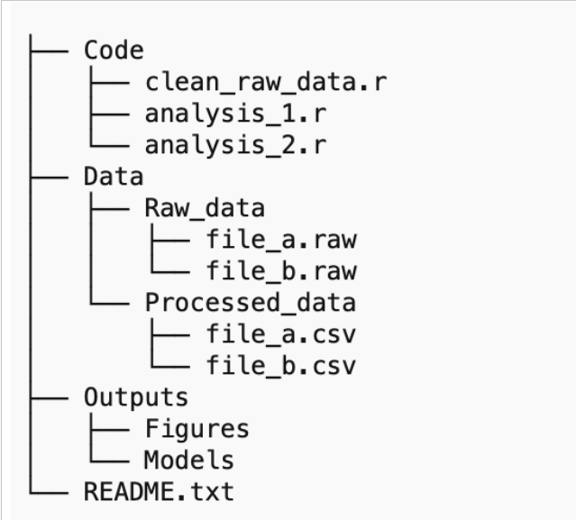
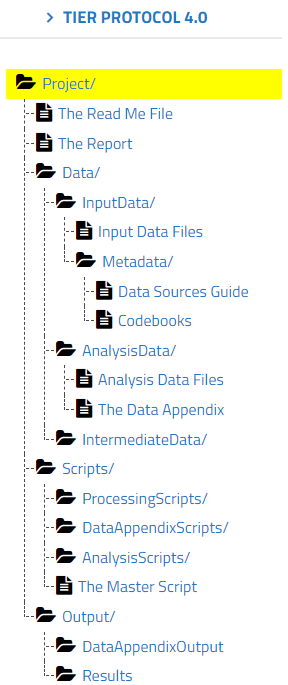
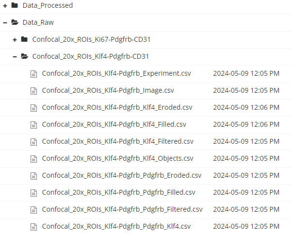

# Principles of dataset deposits

## Ensure your data is a valuable, standalone resource

-    Your dataset should be a [standalone resource]{style="color:green;"}.
-    Your dataset should be [discoverable]{style="color:green;"} and [understandable]{style="color:green;"}.
-    Your dataset must be [reusable]{style="color:green;"} by the community.

::: {.callout-caution collapse="true"}
## Standalone object

Regardless of whether the dataset is linked to a scientific publication, it must be [understandable]{style="color:blue;"} and [independently navigable.]{style="color:blue;"}
:::

## Common issues in data repositories

-    Lack of comprehensive [metadata and readme file(s)]{style="color:red;"} that explain the [context, methodology, and structure of the dataset]{style="text-decoration: underline;"}.

-    [Disorganized/unstructured]{style="color:red;"} data that makes it impossible to reuse.

-    The dataset is treated only as a [supplement]{style="color:red;"} of research articles.

::: {.callout-caution collapse="true"}
## Please avoid

"Details about the methods to generate the data can be found in [XXXX]{style="color:red;"}"
:::

## Sharing data is a professional responsability {.center}

The deposition of a dataset in a repository is not only an exercise to comply with the requirements of funding agencies and journals. It is a an [ethical and professional responsibility]{style="color:green;"} of researchers to ensure reproducible science, and the access and reuse of scientific data.


## Benefits for different stakeholders

### For researchers:

```{mermaid}
%%| fig-width: 10
%%| fig-height: 9

flowchart LR
  A[Efficiency] --> B[Collaborative work] --> C[Reproducibility/impact]
```

### For publishers:

```{mermaid}
%%| fig-width: 10
%%| fig-height: 9

flowchart LR
  A[Rigorous peer review] --> B[Validation and reproducibility] --> C[?????]
```

### For funders:

```{mermaid}
%%| fig-width: 10
%%| fig-height: 9

flowchart LR
  A[Transparency] --> B[Accountability] --> C[Return on Investment]
```


# The Federated Research Data Repository (FRDR)

## Understanding FRDR

::: r-fit-text
The Federated Research Data Repository (FRDR) is a national platform for Canadian researchers to discover, store, and share research data.

**Our goals**:

-    Enhance dataset [discoverability]{style="color:green;"} (in partnership with [Lunaris](https://www.lunaris.ca/)).
-    Promote [open science practices]{style="color:green;"} and the [reuse]{style="color:green;"} of research data.
-    Ensure [long-term preservation]{style="color:green;"} of valuable research data.
:::

::: callout-tip
## FRDR is for canadian researchers

FRDR supports a wide range of disciplines and data types, providing a robust infrastructure for managing and disseminating research data across Canada.
:::

## Benefits of using FRDR

::: r-fit-text
-    FRDR ensures [long-term preservation]{style="color:green;"}, [accessibility]{style="color:green;"} and [usability]{style="color:green;"} of datasets through its curation and preservation team.

-    FRDR supports requirements from Funding [agencies](https://science.gc.ca/site/science/en/interagency-research-funding/policies-and-guidelines/research-data-management/tri-agency-research-data-management-policy-frequently-asked-questions) associated with open access to data (and [research data management plans](https://dmp-pgd.ca/)).

-    Promotes [dataset visibility]{style="color:green;"} and [reuse]{style="color:green;"} across a wide range of discplines.

-    FRDR supports [large datasets]{style="color:green;"}, making it an ideal repository for data-intensive research.

-    FRDR supports researchers in best [data management practices]{style="color:green;"}.
:::

::: callout-tip
## FRDR supports researchers and institutions

FRDR has competent staff to accompany researchers and institutions, ensuring that datasets are valuable and comply with [FAIR](https://www.go-fair.org/fair-principles/) principles.
:::

# General guidelines for dataset deposits

## Datasets as standalone, reusable objects

At FRDR, we aim that datasets are [standalone objects]{style="color:green;"} (independent of research articles) with potential [social, research or educational uses]{style="text-decoration: underline;"}.

::: {style="text-align: center;"}
{fig-align="center" width="500" height="250"}
:::

## Define a dataset schema/road

At the [beginning]{style="color:green;"} (optimal) or [during]{style="color:blue;"} (not bad) your research, define an organized scheme for data, including:

-     Readme/metadata

-     Folders/directory structures

-     file formats

-    Naming conventions

::: callout-tip
Overall, ensure the schema is logical and consistent.
:::

## The guiding light of a dataset: the README

The (main) [Readme]{style="color:blue;"} file is a guide to [understand the dataset]{style="color:green;"} and allow its reuse or execution.

:::: {layout-ncol=2}

::: {style="text-align: left;"}
{fig-align="center" width="500" height="300"}
:::
FRDR users can use our \[text\] or \[web\] template to generate a [readme file]{style="color:blue;"} for deposit into FRDR
::::

## Contents of a readme file


::: r-fit-text
Generally, a dataset readme file showcases:

-    A [dataset identifier]{style="color:green;"} showing aspects such as title, authors, data collection date, Geographic information.
-    A [map of files/folders]{style="color:green;"} defining the hierarchy of folders and subfolders and its content. Here, the user can also define the naming conventions for files and folders.
-    The [methodological information]{style="color:green;"} showcasing the methods for data collection/generation, analysis, and experimental conditions. 

::: {.callout-caution collapse="true"}
## To refresh your memory
The dataset is a standalone object (apart from the research article). Methods and instruments for data collection [MUST NOT]{style="color:red;"} be relegated to the research article. 
:::

-    A set of [instructions and software]{style="color:green;"} for opening, handling and reproduce research pipelines.

-  [Sharing and access information]{style="color:green;"} detailing permissions and conditions of use. 
:::


## Data scheme/organization

And [organized scheme]{style="color:green;"} is the  key to understand data structure.

:::: r-fit-text
:::{layout-ncol=2}

{width=75%}
:::
::::

## Diving into the folder tree{.center}

::::: {layout-ncol=2}

:::: {#first-column}

::: {.callout-tip}
 Plan/define [directory structures, file formats, and naming conventions]{style="text-decoration: underline;"}.   
:::
For example, [TIER 4.0](https://www.projecttier.org/tier-protocol/protocol-4-0/root/) is [systemic template]{style="color:green;"} to standardize and increasing transparency/reproducibility of research data. The user can [download](https://github.com/daniel-manrique/RDM_Training/blob/main/Templates/TIER4.0_DatasetTemplate.zip) a folder structure and adapt it to specific cases.
::::

::: {#second-column}
{width=40%}
:::
:::::

## Organizing a data folder{.center}

 The [data folder]{style="color:green;"} must be organized [logically and hierarchically]{style="color:green;"} according to the characteristics of each dataset. 

##  Input data

Sharing the [input/raw data]{style="color:green;"} is a research integrity and data management best practice. The  "Data_Input/" folder can contain:

::::: {layout-ncol=2}

:::: {#first-column}

### a) Data files (stored in subfolders if necessary)

-   Original images (.tiff, .czi)
-   Measuring device output files (.txt, .csv)
-   Original registration datasheets (.png, .csv, .xlxs)

::::

::: {#second-column}
{width=100%}
:::

:::::

## 

**2. A metadata file/folder**

This **"Metadata/"** folder contains information about the listed data files to ensure understanding and usability. It may list:

-   Data sources guide: It depicts how the data was generated or its provenance. This may include methodological details and technical metadata.
-   Codebooks / data dictionaries: Explain the content of files (mainly .csv tables). They can be [.txt](https://osf.io/9n3gh) or [.csv-xlxs](https://osf.io/925sh) files.

The aim of this resources is to sustain the reuse of the data by providing A faithful and sufficient description of the variables.

## Analysis data

A **"Data_Analysis/"** folder contains (generally cleaned) files used to generate the research results. Like the input data, this files contain a codebook/data dictionary. Also, these files can be accompanied by a "Data_Appendix" files that showcase basic descriptive statistics or show data distributions.

## Intermediate data (Optional)

A **"Data_Intermediate/"** folder may contain partially processed data, or preprocessed files that are not raw data but and do not constitute an element results were taken from. Examples of this are images masks are machine learning classifiers generated during an image processing workflow.

# 3. Documentaing data transformations: Code and Scripts

## 

Although many scientists may feel more comfortable clicking on software (GUIs), the current research landscape demands that we ensure reproducibility of research findings through the use of scripts and analysis code.

Coding should be considered an essential skill of a scientist, just like other research methods (surgeries, patch clamp, flow cytometry, etc).

## 

The best of all is that the main coding schemes (i.e. R and Python) are free to use and have a strong support community.

## Processing scripts

::: r-fit-text
A "Scripts_Processing" folder may contain scripts/code that prepare (or transform) the raw data (images, tables) for analysis (**Data_Analysis/** folder). Examples of workflows:

-   Dropping variables (subsetting the dataset)
-   Generating new variables (Perform computations, calculate means, etc.)
-   Combing different information sources (merging tables or files)

Note: At this point, some intermediary files may be generated. Consider saving them into **"Data_Intermediate/"** folder.

In many cases, the Input Data Files you obtain at the beginning of your project will not be formatted and organized in such a way that you can use them for the analysis that generates the results you present in your report.
:::

## 

You will generate several processing scripts. Logical naming conventions is the key to link the input/output data and the processing script.
