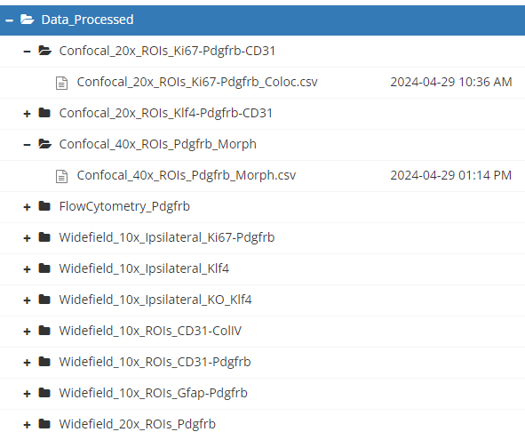
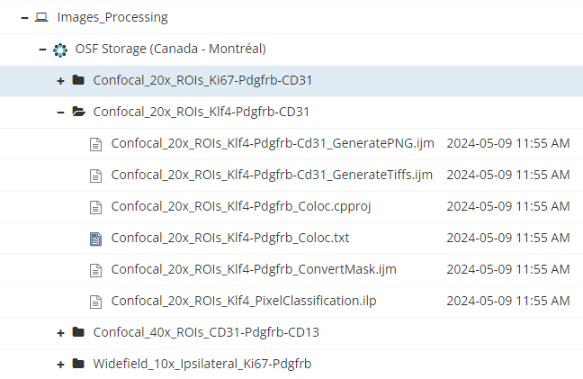
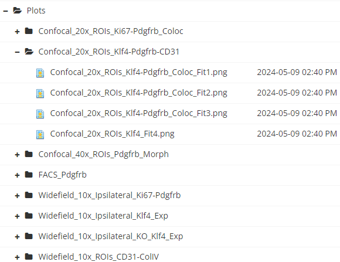

# Principles of dataset deposits

## Ensure your data is a valuable, standalone resource

-    Your dataset should be a [standalone resource]{style="color:green;"}.
-    Your dataset should be [discoverable]{style="color:green;"} and [understandable]{style="color:green;"}.
-    Your dataset must be [reusable]{style="color:green;"} by the community.

::: {.callout-caution collapse="true"}
## Standalone object

Regardless of whether the dataset is linked to a scientific publication, it must be [understandable]{style="color:green;"} and [independently navigable.]{style="color:green;"}
:::

## Common issues in data repositories

-    Lack of comprehensive [metadata and readme file(s)]{style="color:red;"} that explain the [context, methodology, and structure of the dataset]{style="text-decoration: underline;"}.

-    [Disorganized/unstructured]{style="color:red;"} data that makes it impossible to reuse.

-    The dataset is treated only as a [supplement]{style="color:red;"} of research articles.

::: {.callout-caution collapse="true"}
## Please avoid

"Details about the methods to generate the data can be found in [XXXX]{style="color:red;"}"
:::

##  Sharing data is a professional responsability {.center}

The deposition of a dataset in a repository is [NOT ONLY]{style="color:red;"} an exercise to comply with the requirements of funding agencies and journals. It is a an [ethical and professional responsibility]{style="color:green;"} of researchers to ensure reproducible science, and the access and reuse of scientific data.

## Benefits for different stakeholders

###  For researchers:

```{mermaid}
%%| fig-width: 10
%%| fig-height: 9

flowchart LR
  A[Efficiency] --> B[Collaborative work] --> C[Reproducibility/impact]
```

###   For publishers:

```{mermaid}
%%| fig-width: 10
%%| fig-height: 9

flowchart LR
  A[Rigorous peer review] --> B[Validation and reproducibility] --> C[?????]
```

###  For funders:

```{mermaid}
%%| fig-width: 10
%%| fig-height: 9

flowchart LR
  A[Transparency] --> B[Accountability] --> C[Return on Investment]
```

# The Federated Research Data Repository (FRDR)

## Understanding FRDR

::: r-fit-text
The Federated Research Data Repository (FRDR) is a national platform for Canadian researchers to discover, store, and share research data.

**Our goals**:

-    Enhance dataset [discoverability]{style="color:green;"} (in partnership with [Lunaris](https://www.lunaris.ca/)).
-    Promote [open science practices]{style="color:green;"} and the [reuse]{style="color:green;"} of research data.
-    Ensure [long-term preservation]{style="color:green;"} of valuable research data.
:::

::: callout-tip
## FRDR is for canadian researchers

FRDR supports a [wide range of disciplines]{style="color:green;"} and data types, providing a robust infrastructure for [managing and disseminating]{style="color:green;"} research data across Canada.
:::

## Benefits of using FRDR

::: r-fit-text
-    FRDR ensures [long-term preservation]{style="color:green;"}, [accessibility]{style="color:green;"} and [usability]{style="color:green;"} of datasets through its curation and preservation team.

-    FRDR supports requirements from Funding [agencies](https://science.gc.ca/site/science/en/interagency-research-funding/policies-and-guidelines/research-data-management/tri-agency-research-data-management-policy-frequently-asked-questions) associated with open access to data (and [research data management plans](https://dmp-pgd.ca/)).

-    Promotes [dataset visibility]{style="color:green;"} and [reuse]{style="color:green;"} across a wide range of discplines.

-    FRDR supports [large datasets]{style="color:green;"}, making it an ideal repository for data-intensive research.

-    FRDR supports researchers in best [data management practices]{style="color:green;"}.
:::

::: callout-tip
## FRDR supports researchers and institutions

FRDR has competent staff to accompany researchers and institutions, ensuring that datasets are valuable and comply with [FAIR](https://www.go-fair.org/fair-principles/) principles.
:::

# FAIR model

##  Datasets as standalone, reusable objects

At FRDR, we aim that datasets are [standalone objects]{style="color:green;"} (independent of research articles) with potential [social, research or educational uses]{style="text-decoration: underline;"}.

::: {style="text-align: center;font-size: 50%"}
{fig-align="center" width="500" height="250"}
:::

## FAIR principles {.smaller}

:::: {layout-ncol="2"}
::: {#first-column}
 [Findable]{style="color:green;"}

-    Persistent identifiers\
-    Rich metadata
-    Indexed in a searchable resource

 [Accessible]{style="color:green;"}

-    Open files formats\
-    Software requirements
:::

::: {#second-column}
 [Interoperable]{style="color:green;"}

-    Formal, standardized, shared language
-    Reference to other (meta)data

 [Reusable]{style="color:green;"}

-    Adequate context and detailed provenance
-    Accurate/descriptive attributes
-    Clear licence and usage permissions
:::
::::

# General guidelines for dataset deposits

##  General guidelines for sharing data{.center}

1.   Define a dataset [schema/road]{style="color:green;"}
2.   Write a [readme]{style="color:green;"}/metadata file
3.   Organize [data]{style="color:green;"} folders and scripts/[codes]{style="color:green;"} folders

## 1. Define a dataset schema/road

At the [beginning]{style="color:green;"} (optimal) or [during]{style="color:green;"} (not bad) your research, define an organized scheme for data.

::: callout-tip
## Think about

-    Folders/[directory structures]{style="color:green;"}
-    Think about [file types/formats]{style="color:green;"}
-    Establish logical/descriptive [naming conventions]{style="color:green;"}
:::

Overall, ensure the schema is [logical and consistent]{style="color:green;"}. An external user must be able to understand the directory structure.

## 2. The guiding light of a dataset: the README

The (main)  [readme]{style="color:green;"} file is a guide to [understand the dataset]{style="color:green;"} and allow its reuse or execution.

::::: {layout-ncol="2"}
:::: {#first-column}

::: {style="text-align: center; font-size: 50%"}
{fig-align="center" width="500" height="300"}
:::
::::

:::: {#second-column}
::: {style="font-size: 80%;"}
FRDR users can use our \[text\] or \[web\] template to generate a [readme file]{style="color:green;"} for deposit into FRDR. 

Additional resources are:   
  - [Creating a README file](https://blog.datadryad.org/2023/10/18/for-authors-creating-a-readme-for-rapid-data-publication/)  
  - [Readme.so](https://readme.so/)     
  - [Readme.ai](https://readme-ai.streamlit.app/)  
:::
::::
:::::

## Contents of a readme file

::: r-fit-text
Generally, a dataset readme file showcases:

-    A [dataset identifier]{style="color:green;"} showing aspects such as title, authors, data collection date, Geographic information.
-    A [map of files/folders]{style="color:green;"} defining the hierarchy of folders and subfolders and its content. Here, the user can also define the naming conventions for files and folders.
-    The [methodological information]{style="color:green;"} showcasing the methods for data collection/generation, analysis, and experimental conditions.

::: {.callout-caution collapse="true"}
## To refresh your memory

The dataset is a standalone object (apart from the research article). Methods and instruments for data collection [MUST NOT]{style="color:red;"} be relegated to the research article.
:::

-    A set of [instructions and software]{style="color:green;"} for opening, handling and reproduce research pipelines.

-    [Sharing and access information]{style="color:green;"} detailing permissions and conditions of use.
:::

## 3. Organize dataset folders

And [organized scheme]{style="color:green;"} is the  key to understand data structure.

::::: {layout-ncol="2"}
:::: {#first-column}
::: {style="text-align: center;font-size: 50%"}
 
:::
::::

:::: {#second-column}
::: {style="text-align: center;font-size: 50%"}
{width="75%"}
:::
::::
:::::

##  Diving into the folder tree {.center}

::::: {layout-ncol="2"}

:::: {#first-column}

::: callout-tip
 Plan/define [directory structures, file formats, and naming conventions]{style="text-decoration: underline;"}.
:::

For example, [TIER 4.0](https://www.projecttier.org/tier-protocol/protocol-4-0/root/) is [systemic template]{style="color:green;"} to standardize and increasing transparency/reproducibility of research data. The user can [download](https://github.com/daniel-manrique/RDM_Training/blob/main/Templates/TIER4.0_DatasetTemplate.zip) a folder structure and adapt it to specific cases.
::::

:::: {#second-column}
::: {style="text-align: center;font-size: 50%"}
{width="45%"}
:::

::::

:::::

##  Organizing a data folder{.center}

The [data]{style="color:green;"}  must be organized [logically and hierarchically]{style="color:green;"} according to the characteristics of each dataset.

##  Input data

Sharing the [input/raw data]{style="color:green;"} is a research integrity and data management best practice. The [Data_Input/]{style="color:orange;"}  can contain:

::::: {layout-ncol="2"}

:::: {#first-column}
### a) [Data files]{style="color:magenta;"} (stored in subfolders if necessary)

-   Original [images]{style="color:green;"} (.tiff, .czi)
-   Measuring device [output files]{style="color:green;"} (.txt, .csv)
-   Original registration [datasheets]{style="color:green;"} (.png, .csv, .xlxs)
::::

:::: {#second-column}
::: {style="text-align: center;font-size: 50%"}
{width="90%"}
:::
::::
:::::


## 

### b) A [metadata]{style="color:magenta;"} file/folder 

This [Metadata/]{style="color:orange;"}  contains information about the listed data files to ensure understanding and usability. It may list:

-   [Data sources guide:]{style="color:green;"} It depicts how the data was [generated]{style="text-decoration: underline;"}. or its [provenance]{style="text-decoration: underline;"}.. This may include [methodological details]{style="text-decoration: underline;"}. and [technical metadata]{style="text-decoration: underline;"}..
-   [Codebooks / data dictionaries:]{style="color:green;"} Explain the [content of files]{style="text-decoration: underline;"}. (mainly .csv tables). They can be [.txt](https://osf.io/9n3gh) or [.csv-xlxs](https://osf.io/925sh) files.

The aim of this resources is to [sustain the reuse]{style="color:green;"} of the data by providing a faithful and [sufficient description]{style="color:green;"} of the variables.

##  Analysis data{.center}

A [Data_Analysis/]{style="color:orange;"}  contains [processed files]{style="color:green;"}, those used to generate the research results.

::::: {layout-ncol="2"}

:::: {#first-column}
Like the input data, this files contain a [codebook/data dictionary]{style="color:green;"}. Also, these files can be accompanied by a [Data_Appendix]{style="color:green;"} files that showcase basic descriptive statistics or show data distributions.
::::

:::: {#second-column}
::: {style="text-align: center;font-size: 50%"}
{width="90%"}
:::
::::
::::: 


##  Intermediate data (Optional){.center}

A [Data_Intermediate/]{style="color:orange;"}  may contain mid-step processed data, or pre-processed files as part of an analysis pipeline. Examples may be images 'masks' are machine learning classifiers used to further operate with images.


##  Scripting is the way{.smaller}

Although most scientists may feel more comfortable using clicking software (GUIs), the current research landscape demands to ensure reproducibility of research findings through the use of scripts and (analysis) code.

::: callout-tip
 Coding should be considered an [essential skill]{style="color:green;"} , just like other methods such as surgeries, patch clamp, flow cytometry).
:::

{fig-align="center"}

##  Processing scripts

:::: r-fit-text

::: {.callout-caution collapse="true"}
The data you obtain from measurements may not be formatted and organized to analyze it and generate results.
:::

A [Scripts_Processing]{style="color:orange;"}  may contain scripts/code that prepare (or transform) the raw data (images, tables) for analysis [Data_Analysis/]{style="color:orange;"} .   

[Examples of workflows:]{style="text-decoration: underline;"}

-   Dropping variables (subsetting the dataset)
-   Generating new variables (Perform computations, calculate means, etc.)
-   Combing different information sources (merging tables or files)

::: callout-tip
Yo can consider saving the generated intermediary files into the [Data_Intermediate/]{style="color:orange;"} .
:::

::::

##  Keep in mind{.center}

You will generate several processing scripts. [Logical naming conventions]{style="color:green;"} are the key to link the input/output data with the processing scripts.

##  Analysis scripts{.smaller}

::::: {layout-ncol="2"}

:::: {#first-column}
The [Scripts_Analisys]{style="color:orange;"}  host scripts/code to generate results that may be in the form of:   

-    Images
-    Figures
-    Tables
-    Statistical models

::::

:::: {#second-column}
::: {style="text-align: center;font-size: 50%"}
{width="90%"}
:::
::::

:::::

::: callout-tip
Generally speaking, this scripts import and handle the [Analysis data]{style="color:orange;"}.
:::

##  A master script?{.center}

The [Scripts/]{style="color:orange;"}  can also contain a [master script]{style="color:green;"} that executes all other scripts, forming a fully automated pipeline.

##  The output folder

::::: {layout-ncol="2"}

:::: {#first-column}
The [Output/]{style="color:orange;"}  contains subfolders storing the files generated by the analysis scripts in the form of:

-    Images
-    Figures
-    Tables
-    Statistical models
::::

:::: {#second-column}
::: {style="text-align: center;font-size: 50%"}
{width="100%"}
:::
::::

:::::

##  Commitment with reproducibility{.center}

Sharing the output resulting from computations/code is one of the best better commitments to [open and reproducible science]{style="color:green;"}. It is also a way to preserve material for later use in an organized manner. 


# Data submission checklist


##  Submitting your data to a repository{.smaller}

When submitting your data to a repository (FRDR), ensure its meets these characteristics:

1.  [Your folders and files are organized in a clear and structured way]{style="color:green;"} (understandable for the community): Use [standardized file formats]{style="color:green;"} (e.g., CSV, TIFF) and check for consistency in [naming conventions]{style="color:green;"}.

2.  [The metadata/readme is as complete as possible]{style="color:green;"} and allow to understand the dataset as standalone object, providing data [collection methods, processing steps, and relevant context]{style="text-decoration: underline;"}.

3.  [Verify independent usability]{style="color:green;"}: data must be [complete and understandable]{style="text-decoration: underline;"} (Include any necessary instructions for data interpretation) without needing the accompanying research article.


## In summary{.center}
Be aware that the datatset is a research object to [serve the public and the scientific community]{style="color:green;"}, and that can be used (and cited) [independently]{style="color:green;"} of the research article. 

[Better yet, Think about articles as supplements to your dataset!!!]{style="color:green;"}

---

## Resources and support{.smaller}

### Supporting material
- XXX
- XXX

### Support Services:
- Contact our team for assistance with data preparation and submission.
- Email: daniel.manrique-castano@alliancecan.ca

## Useful Links:
- XXX
- XXX 

We are here to help you ensure your data is well-prepared and can be effectively shared with the research community.


